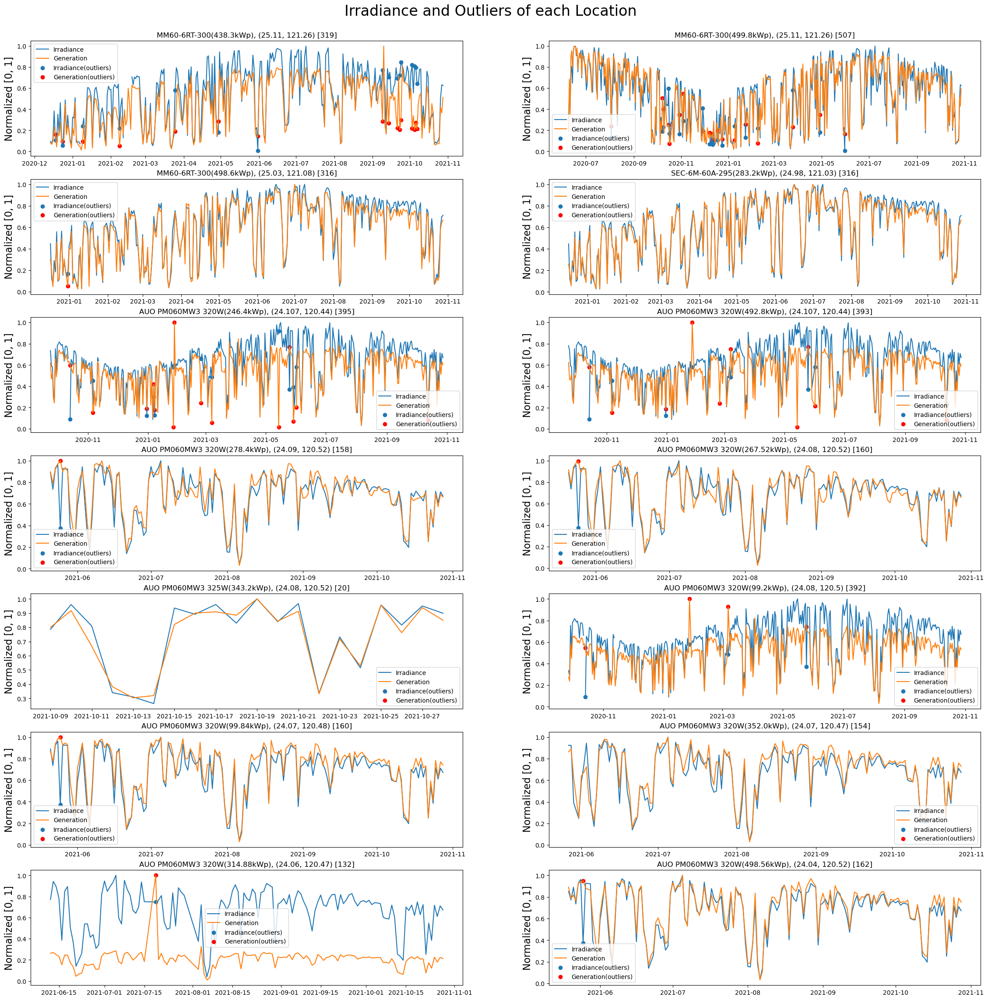
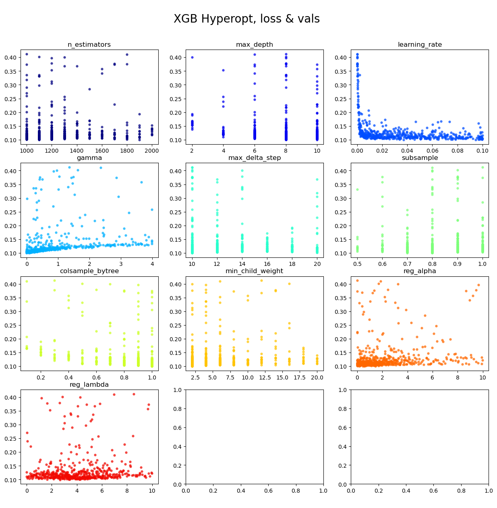
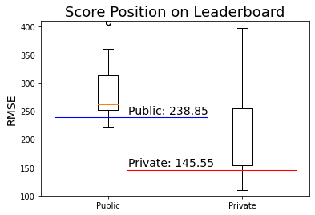

# AIdea: Solar PV Forecast - Surplux

[AIdea 太陽能發電量預測競賽, ITRI, Surplux Energy](https://aidea-web.tw/topic/09679060-518a-4e6f-94db-53c7d8de8138)

## 簡介

淨零排放 (Net Zero Emissions) 已成為國際共識與全球目標，目前已累積逾 136 國參與，甚至部分國家已達初期設定標。近來台灣擬定 4 大策略，預計 2050 年實現淨零碳排，而提升太陽光電、風力發電等再生能源發電比例也是能源轉型的重要方向。

本議題透過太陽能發電歷史資料如日射量、裝置容量…等，以機器學習的方法預測各地的太陽能發電量，期望參賽者能掌握影響太陽能發電量的關鍵因素，並對於未來太陽能建置細節擬定能有相當程度的助益。

獲獎條件：在 Private Leaderboard 低於 baseline (RMSE < 260)

## 活動時間

議題進行時間以台灣時間 (UTC+8 小時) 為主，其時程如下:

- 2022/04/20 開放報名及下載訓練資料集
- 2022/06/21 23:59:59 上傳答案截止
- 2022/06/23 公布 Private Leaderboard，開始上傳報告
- 2022/06/30 23:59:59 上傳報告截止
- 2022/07/06 公布得獎名單

## 排名

參加期間總共上傳 18 次[^1] 答案，最終排名如下：

|         |   RMSE    |  排名  |
| :------ | :-------: | :----: |
| Public  | 238.85634 | 9/179  |
| Private | 145.55749 | 20/179 |

[^1]: 每次上傳答案在 Public Leaderboard 的分數請參考 `src/submission/README.md`

## 官方資料

本議題提供之逐 1 日資料如下：

- 發電量訓練集，共 3,585 筆，檔案名稱：train.csv
- 發電量測試集，共 1,540 筆，檔案名稱：test.csv

| 欄位名稱     | 欄位說明                                              |
| ------------ | ----------------------------------------------------- |
| ID           | 資料編號                                              |
| Date         | 資料日期                                              |
| Lat          | 緯度                                                  |
| Lon          | 經度                                                  |
| Angle        | 面向角度 (0 為正南方，正值為偏向西方，負值為偏向東方) |
| Module       | 模組型號[^4]                                          |
| Capacity     | 裝置容量 (kWp)                                        |
| Generation   | 預測目標 - 發電量 (kWh)                               |
| Temp         | 當日平均氣溫 (°C)[^2]                                 |
| Temp_m       | 模溫計：模板溫度 (°C)[^3]                             |
| Irradiance   | 日射量 (MJ/m²)[^2]                                    |
| Irradiance_m | 日照計：日射量 (Wh/m²)[^3]                            |

[^2]: 外部資料來源：農作物災害預警平台
[^3]: 因於硬體限制，非所有型號皆有資料，且部分發電廠有誤植情形，最好不要使用此欄位，分析過程參考 [analysis.ipynb](/src/analysis.ipynb)
[^4]:
    模組型號
    | | MM60-6RT-300 | SEC-6M-60A-295 | AUO PM060MW3 320W | AUO PM060MW3 325W |
    | --------------- | ------------ | -------------- | ----------------- | ----------------- |
    | 峰值輸出 (Pmax) | 300W | 295W | 320W | 325W |
    | 峰值電壓 (Vmp) | 32.61 | 31.6 | 33.48 | 33.66 |
    | 峰值電流 (Imp) | 9.2 | 9.34 | 9.56 | 9.66 |
    | 開路電壓 (Voc) | 38.97 | 39.4 | 40.9 | 41.1 |
    | 短路電流 (Isc) | 9.68 | 9.85 | 10.24 | 10.35 |
    | 模組效能 (%) | 18.44% | 17.74% | 19.2% | 19.5% |

    以官方公開資料為準。STC 標準測試狀況︰1000W/m²，空氣大氣光程 AM 1.5，25℃

## 外部資料

[中央氣象局觀測資料查詢系統](https://e-service.cwb.gov.tw/HistoryDataQuery/downloads/Readme.pdf)逐 1 小時觀測資料

| 欄位名稱              | 欄位說明        |
| --------------------- | --------------- |
| Irradiance(kWh/m2)    | 輻射量 (kWh/m2) |
| HourlyTemperature(°C) | 溫度 (°C)       |
| HourlyHumidity(m/s)   | 濕度 (%)        |
| HourlyWindSpeed(m/s)  | 風速 (m/s)      |
| HourlyCloudAmount(%)  | 雲量 (%)        |

使用套件 [pvlib-python](https://github.com/pvlib/pvlib-python) 計算逐 1 小時晴空輻射

| 欄位名稱           | 欄位說明            |
| ------------------ | ------------------- |
| ClearSkyIrradiance | 晴空輻射量 (kWh/m²) |

## 方法

比賽題目是預測多個案場在未來 2021.10.29 ~ 2022.02.17 間的逐日累積發電量，相對現在時間點來說，給定的預測範圍已經是過去式，可以合法取得歷史輻射資料，這個題目實質上是在預測發電機組的陣列轉換率[^5]。

[^5]: Array to Inverter Ratio

### Outliers

對異常值進行處理，這裡定義 ArrayRatio 高於平均值 +0.5 或低於平均值 -0.5 為異常值，總共 69 筆 (1.9%) 異常值，異常值有可能被直接移除，或在移除後視為缺失值進行補值，將在後續實驗進行比較。

### Missing Value

對缺失值進行處理，分別計算訓練集與測試集的缺失值比例，再根據缺值狀況進行處理。

| Column                     | Train Missing (Day) | Train Missing (Hour) | Test Missing (Day) | Test Missing (Hour) |
| -------------------------- | ------------------: | -------------------: | -----------------: | ------------------: |
| Generation(kWd)            |                  0% |                    - |                  - |                   - |
| Irradiance(kWd/m2)         |               0.66% |                    - |                 0% |                   - |
| Temperature(°C)            |               0.42% |                    - |             11.89% |                   - |
| Irradiance(kWh/m2)         |                   - |                   0% |                  - |                  0% |
| ClearSkyIrradiance(kWh/m2) |                   - |                   0% |                  - |                  0% |
| HourlyTemperature(°C)      |                   - |                2.19% |                  - |                  0% |
| HourlyHumidity(%)          |                   - |                2.19% |                  - |                  0% |
| HourlyWindSpeed(m/s)       |                   - |                0.48% |                  - |                  0% |
| HourlyCloudAmount(%)       |                   - |               89.40% |                  - |              87.80% |

#### 補值

- Irradiance(kWd/m2) 的缺失值比例不到 1%，由於有發電量作為參考，可以嘗試使用陣列轉換率推估輻射值。
- HourlyTemperature(%) 在訓練集的缺失值比例為 2.19%，使用線性差值進行補值。
- HourlyHumidity(%) 在訓練集的缺失值比例為 2.19%，使用線性差值進行補值。
- HourlyWindSpeed(%) 在訓練集的缺失值比例為 0.48%，使用線性差值進行補值。

#### 刪除列

- Irradiance(kWd/m2) 的缺失值比例不到 1%，也可以直接刪除缺值的列，將在後續實驗與補值法進行比較。

#### 刪除欄

- Temperature(°C) 在測試集的缺失值比例超過 10%，且其中 87% 是連續缺值，補值的效果可能不太理想，考慮到還有氣象局的資料可以用，故直接刪除該欄位。
- HourlyCloudAmount 的缺失值比例超過 50%，原因是部分觀測站沒有雲量資料，故直接刪除該欄位。

### Rule Based Method

在最初幾次提交，使用 Rule Based 方法計算每個案場的歷史陣列轉換率，再乘以預測範圍的觀測輻射推算發電量，作為其他模型的參考基準，結果顯示 Rule Based 方法的 RMSE 約為 277 單位。

**使用 Rule Based 方法推估發電量的實驗**

| 項目 | 方法                                                       | Public RMSE |
| :--- | :--------------------------------------------------------- | :---------- |
| 1    | 將歷史資料基於經緯分組，計算轉換率[^5] 用於推算發電量      | 277.33373   |
| 2    | 將歷史資料基於經緯及模組容量分組，計算轉換率用於推算發電量 | 278.91238   |

1. rule_based_groupby_lat_lon
2. rule_based_groupby_lat_lon_module_capacity

為了準確計算每個發電廠的陣列轉換率，將資料先依據經度、緯度、機組型號及裝置容量替原始資料分組，然後再使用歷史發電量、觀測輻射及裝置容量計算每個群組的陣列轉換率。

### Machine Learning Method: Explore

參考過去研究，使用 XGboost 預測逐 1 日的發電量，為了提高預測準確性而加入 2 項外部資料，包括中央氣象局觀測資料查詢系統的逐 1 小時輻射量，以及套件 pvlib-python 以物理方式計算的逐 1 小時晴空輻射量，它們在過去的研究中被證實是預測發電量的重要特徵。

**基礎特徵與發電量的皮爾森相關係數**

| 欄位名稱                   | 欄位說明         | 相關係數 |
| -------------------------- | ---------------- | -------: |
| Irradiance(kWd/m2)         | 逐日輻射量       |   0.6142 |
| Irradiance(kWh/m2)         | 逐小時輻射量     |   0.6633 |
| ClearSkyIrradiance(kWh/m2) | 逐小時晴空輻射量 |   0.2914 |
| DayOfYearTransformed       | 一年中的第幾天   |   0.2767 |

使用循序向後選擇演算法 (Sequential Backward Selection) 挑選特徵，經過實驗，可以發現上述特徵都能夠提升發電量預測的績效，具體的輸入變數組成如下：

- 逐小時觀測輻射 24 筆：目標日的 24 小時輻射量，取自觀測資料查詢系統[^6]。
- 逐小時晴空輻射 24 筆：目標日的 24 小時晴空輻射量，使用物理方式計算[^7]，作為最大輻射量的參考值。
- 逐日觀測輻射 1 筆：目標日的整日累計輻射量，取自議題提供之原始資料，由於是累計量，能提供的資訊較少。
- DayOfYearTransformed：日期參數，表示目標日為一年中的第幾天，能幫助模型理解季節變化。

**建立基礎模型的實驗**

| 項目 | 方法                                                                      |     Valid |  Public   |
| :--- | :------------------------------------------------------------------------ | --------: | :-------: |
| 1.A  | 基於經緯度、模組及裝置容量分組，再以預測日的觀測輻射為輸入變數[^8]        | 190.67076 |           |
| 1.B  | 基於經緯度、模組及裝置容量分組，再以預測日的觀測及晴空輻射為輸入變數[^9]  | 159.87101 |           |
| 1.C  | 基於經緯度、模組及裝置容量分組，再以預測日的觀測及晴空輻射為輸入變數[^10] | 159.27911 | 271.40773 |

[^6]: 外部資料來源：中央氣象局觀測資料查詢系統
[^7]: 外部資料來源：使用套件 [pvlib-python](https://github.com/pvlib/pvlib-python) 計算晴空輻射
[^8]: 輸入變數：逐 1 日觀測輻射、逐小時 24 筆觀測輻射
[^9]: 輸入變數：逐 1 日觀測輻射、逐小時 24 筆觀測輻射、逐小時 24 筆晴空輻射
[^10]: 輸入變數：逐 1 日觀測輻射、逐小時 24 筆觀測輻射、逐小時 24 筆晴空輻射及日期參數 DayOfYearTransformed

在得到基礎模型後，開始嘗試處理異常值及缺失值，如下表所示，雖然 3 種處理方式都能改善模型的績效，但直接剔除異常值及缺失值的效果最好，因此最終採用該方法。

**處理離群值與缺失值的實驗**

| 項目 | 方法                                                                    |     Valid |  Public   |
| :--- | :---------------------------------------------------------------------- | --------: | :-------: |
| 2.A  | 延續項目 1.C 的實驗，但剔除訓練資料中的離群值與缺值                     | 130.93321 | 269.38945 |
| 2.B  | 延續項目 1.C 的實驗，但替換訓練資料中的離群值與缺值，使用前述補值法     | 142.74066 |           |
| 2.C  | 延續項目 1.C 的實驗，但剔除訓練資料中的離群值，並使用前述補值法處理缺值 | 135.68382 |           |

1. xgb_groupby_lat_lon_module_capacity_1d_doyt
2. xgb_groupby_lat_lon_module_capacity_1d_doyt_outlier

### Machine Learning Method: Group by Longitude

針對先前最佳實驗進行錯誤分析後，發現在績效較差的發電廠裡面 AUO PM060MW3 325W 的訓練資料僅有 20 筆，可能是模型泛化能力不足的原因，因此嘗試以 rule-based 方法替換該模組的預測值作為應急手段，參考項目 1 的實驗，可以發現在 Public Dataset 的績效有稍微改善。然而這個方法在內部驗證集的績效變差，必須尋找其他根本性的解決方法。

**依據經度、緯度、機組型號及裝置容量分組的各組資料量與預測誤差**

| Module            | Capacity |    Lat |    Lon | Count | Valid RMSE |
| ----------------- | -------: | -----: | -----: | ----: | ---------: |
| MM60-6RT-300      |    438.3 |  25.11 | 121.26 |   319 |  206.20003 |
| MM60-6RT-300      |    499.8 |  25.11 | 121.26 |   507 |  196.28981 |
| MM60-6RT-300      |    498.6 |  25.03 | 121.08 |   316 |  119.89374 |
| SEC-6M-60A-295    |    283.2 |  24.98 | 121.03 |   316 |   49.99711 |
| AUO PM060MW3 320W |    246.4 | 24.107 | 120.44 |   395 |   81.59316 |
| AUO PM060MW3 320W |    492.8 | 24.107 | 120.44 |   393 |  155.83606 |
| AUO PM060MW3 320W |    278.4 |  24.09 | 120.52 |   158 |    73.4277 |
| AUO PM060MW3 320W |   267.52 |  24.08 | 120.52 |   160 |   88.29628 |
| AUO PM060MW3 325W |    343.2 |  24.08 | 120.52 |    20 |  197.80633 |
| AUO PM060MW3 320W |     99.2 |  24.08 |  120.5 |   392 |   29.60536 |
| AUO PM060MW3 320W |    99.84 |  24.07 | 120.48 |   160 |   28.99647 |
| AUO PM060MW3 320W |      352 |  24.07 | 120.47 |   154 |  143.27273 |
| AUO PM060MW3 320W |   314.88 |  24.06 | 120.47 |   132 |  111.94254 |
| AUO PM060MW3 320W |   498.56 |  24.04 | 120.52 |   162 |    50.3799 |
| Total             |          |        |        |  3584 |  130.93321 |

**使用 rule-based 方法進行應急修正的實驗**

| 項目 | 方法                                                                  |     Valid |    Public |
| :--- | :-------------------------------------------------------------------- | --------: | --------: |
| 1    | 延續先前最佳實驗，僅以 rule-based 方法替換 AUO PM060MW3 325W 的估計值 | 131.20086 | 258.79723 |

使用 rule-based 方法替換僅是應急手段，為了解決資料量問題，嘗試在訓練模型的時候僅根據經度或緯度分組，試圖提升每個群組的資料量[^12]。

由於每個發電廠的規模不同，將它們混合建模的時候，需要先將發電量正規化，待模型輸出預測值後再還原。所以在這個章節的項目 2 先嘗試將發電量正規化，後續再進行根據緯度或經度分組的實驗，然而前述 2 種分組方式在 Public Dataset 的績效都變差。觀察原始資料後發現，有可能因為群組裡面的發電廠位置接近，作為輸入變數的觀測輻射取自相同的氣象局觀測站，使得模型無法從輸入變數辨別不同的發電廠，故在輸入變數追加發電廠的裝置容量，使模型能夠理解不同規模的發電廠之間的差異[^13]，這個階段最終的輸入變數組成如下：

- 逐小時觀測輻射 24 筆：目標日的 24 小時輻射量，取自觀測資料查詢系統
- 逐小時晴空輻射 24 筆：目標日的 24 小時晴空輻射量，使用物理方式計算，作為最大輻射量的參考值
- 逐日觀測輻射 1 筆：目標日的整日累計輻射量，取自議題提供之原始資料，由於是累計量，能提供的資訊較少
- 案場裝置容量：每個案場的裝置容量，作為最大發電量的參考值
- DayOfYearTransformed：日期參數，表示目標日為一年中的第幾天，能幫助模型理解季節變化

**根據經緯度分組增加資料量的實驗**

| 項目 | 方法                                                                  |     Valid |    Public |
| :--- | :-------------------------------------------------------------------- | --------: | --------: |
| 1    | 延續先前最佳實驗，僅以 rule-based 方法替換 AUO PM060MW3 325W 的估計值 | 131.20086 | 258.79723 |
| 2    | 延續先前最佳實驗，先將發電量除以裝置容量正規化，預測後再還原          | 131.03074 | 258.46331 |
| 3    | 將 14 個發電廠依據緯度分組，再以預測日的輻射為輸入變數[^10]           | 119.81352 | 276.31831 |
| 4    | 將 14 個發電廠依據經度分組，再以預測日的輻射為輸入變數[^10]           | 119.65769 | 269.63295 |
| 5    | 延續項目 3 基於緯度分組的架構，並在輸入變數追加裝置容量[^11]          | 104.84255 |           |
| 6    | 延續項目 4 基於經度分組的架構，並在輸入變數追加裝置容量[^11]          |  101.8543 |           |

1. xgb_groupby_lat_lon_module_capacity_1d_doyt_outlier_replace
2. xgb_groupby_lat_lon_module_capacity_1d_doyt_normalized_outlier
3. xgb_groupby_lat_1d_doyt_normalized_outlier_replace
4. xgb_groupby_lon_1d_doyt_normalized_outlier_replace

在這個階段的實驗，證實了基於經度的分組方法能夠改善模型的泛化能力，參考下表，可以發現每個群組的誤差都不再像之前那麼高。

**依據經度分組的各組資料量與預測誤差**

|    Lon | Count | Valid RMSE |
| -----: | ----: | ---------: |
| 121.26 |   826 |  165.37857 |
| 121.08 |   316 |  124.49707 |
| 121.03 |   316 |   52.32305 |
| 120.52 |   500 |   82.50939 |
|  120.5 |   392 |    28.9817 |
| 120.48 |   160 |   29.09077 |
| 120.47 |   286 |  106.81552 |
| 120.44 |   788 |   54.87539 |
|  Total |  3584 |   101.8543 |

[^11]: 輸入變數：逐 1 日觀測輻射、逐小時 24 筆觀測輻射、逐小時 24 筆晴空輻射、裝置容量 Capacity 及日期參數 DayOfYearTransformed
[^12]: 不同區域，或甚至同區域的案場，可能因為人為、環境或設備保養狀況等因素，而有不同的發電效率，混在一起訓練會增加問題複雜度
[^13]: 基於經度或緯度分組雖然可以大幅增加每個群組的資料量，但由於群組裡面發電廠的位置都很接近，作為輸入變數的觀測輻射取自相同的氣象局觀測站，使得模型無法從輸入變數辨別不同的發電廠，加入裝置容量使模型能夠辨別它們

### Machine Learning Method: Feature Selection

在這個章節，使用循序向後選擇演算法 (Sequential Backward Selection) 挑選中央氣象局的其他觀測資料作為輸入變數，以提高模型的泛化能力，挑選順序依據特徵與發電量的相關係數由高至低排序，由於主辦單位僅提供每日發電量，故計算相關性的時候會先將氣象局的逐 1 小時觀測資料轉換成逐 1 日的觀測資料，再與發電量計算相關係數。

**中央氣象局觀測資料與發電量的皮爾森相關係數**

| 欄位名稱              | 欄位說明 | 相關係數 |
| --------------------- | -------- | -------: |
| Irradiance(kWh/m2)    | 輻射量   |   0.6633 |
| HourlyTemperature(°C) | 溫度     |   0.3561 |
| HourlyHumidity(m/s)   | 濕度     |  -0.2881 |
| HourlyWindSpeed(m/s)  | 風速     |  -0.1994 |

經過實驗，可以發現所有額外的氣象觀測資料都不能提高模型的績效，這可能是由於輻射量與發電量的高相關，使其他氣象觀測資料的影響力被淡化。另外，在這個階段的實驗開始前，由於設定錯誤，我在先前的最佳實驗[^11]裡面追加放入過去 1 日的輻射資料，所以基礎模型的特徵[^14]變動如下：

- 逐小時觀測輻射 48 筆：目標日及過去 1 日的 24 小時輻射量，取自觀測資料查詢系統
- 逐小時晴空輻射 48 筆：目標日及過去 1 日的 24 小時晴空輻射量，使用物理方式計算，作為最大輻射量的參考值
- 逐日觀測輻射 1 筆：目標日的整日累計輻射量，取自議題提供之原始資料，由於是累計量，能提供的資訊較少
- 案場裝置容量：每個案場的裝置容量，作為最大發電量的參考值
- DayOfYearTransformed：日期參數，表示目標日為一年中的第幾天，能幫助模型理解季節變化

| 項目 | 方法                                                   |     Valid |    Public |
| :--- | :----------------------------------------------------- | --------: | --------: |
| 1    | 延續先前最佳實驗，並在輸入變數追加過去 1 日的輻射[^14] | 108.05824 | 238.85634 |
| 2    | 延續項目 1 的實驗，並在輸入變數追加逐小時溫度          | 108.31281 |           |
| 3    | 延續項目 1 的實驗，並在輸入變數追加逐小時濕度          | 108.86291 |           |
| 4    | 延續項目 1 的實驗，並在輸入變數追加逐小時風速          | 108.92206 |           |

1. xgb_groupby_lon_1d_doyt_prev1d_capacity_normalized_outlier

[^14]: 輸入變數：逐 1 日觀測輻射、逐小時 48 筆觀測輻射、逐小時 48 筆晴空輻射、裝置容量 Capacity 及日期參數 DayOfYearTransformed

### Machine Learning Method: Hyperparameter Optimization

在這個章節，由於擔心模型對 Public Dataset 過度擬合，所以使用 Hyperopt 套件對 XGboost 的超參數進行調整，該演算法會根據損失函數調整模型的超參數，但由於它們提交至 Public Leaderboard 的 RMSE 都沒有低於先前最佳的 238 單位，因此最終仍保留先前最佳的結果作為 Private Submission。

| 項目 | 方法                               |    Public |
| :--- | :--------------------------------- | --------: |
| 1    | 先前最佳實驗                       | 238.85634 |
| 2    | 延續前個實驗，進行模型的超參數調整 | 241.13532 |
| 3    | 延續前個實驗，進行模型的超參數調整 | 242.54411 |

1. xgb_groupby_lon_1d_prev1d_doyt_capacity_normalized_outlier
2. xgb_groupby_lon_1d_prev1d_doyt_capacity_normalized_outlier_hpo_v1
3. xgb_groupby_lon_1d_prev1d_doyt_capacity_normalized_outlier_hpo_v2

下圖是超參數調整的過程，可以看到部分超參數有集中的趨勢，表示這些超參數對模型的影響較大，可惜這項調整最終沒有被採用。

## 結論

在這個比賽，最終取得了 Public 前 5% (9/179) 及 Private 前 11% (20/179) 的成績。

  

從 Public 及 Private 的成績落差，可以推測 Public Dataset 與 Private Dataset 的資料特性有顯著差異，而我的模型對 Public 過於擬合，導致在 Private 的表現不佳，對於這個比賽，以下作法可能可以得到更好的成績：

1. 在發電廠的分組策略，這次粗略使用經度或緯度分組，但實際上應該要以距離分組，例如：以 1 公里為單位，將範圍內的發電廠視為群組。
2. 在結果提交策略，應該將 Public Leaderboard 的結果作為參考，實際在選擇 Private Submission 的時候，使用其他更平衡的指標，例如：將訓練資料依月份提取固定比例，作為驗證資料。
