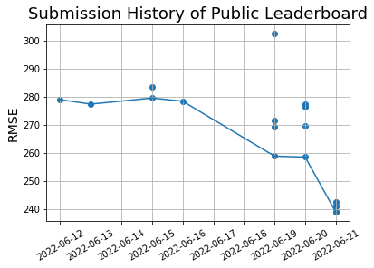

## Submission History & Leaderboard

  

### Private Leaderboard

|  排名  | Public 排名 | 隊伍名稱  |        成績 |   次數 |
| :----: | ----------: | :-------- | ----------: | -----: |
|   1    |           1 | A\*\*\*   |     110.115 |    314 |
|   2    |           6 | c\*\*\*   |      128.75 |     65 |
|   3    |           8 | j\*\*\*   |     129.122 |     55 |
|   4    |          16 | h\*\*\*   |     130.173 |     26 |
|   5    |           3 | e\*\*\*   |     130.372 |    105 |
|   6    |          22 | b\*\*\*   |     132.658 |     55 |
|   7    |           2 | N\*\*\*   |     134.345 |     61 |
|   8    |          10 | m\*\*\*   |     135.399 |     19 |
|   9    |           4 | w\*\*\*   |     136.012 |    105 |
|   10   |           5 | g\*\*\*   |     137.022 |    109 |
|   11   |          53 | 1\*\*\*   |     138.137 |     20 |
|   12   |           7 | 1\*\*\*   |     140.059 |    132 |
|   13   |          38 | c\*\*\*   |     141.483 |     17 |
|   14   |          32 | A\*\*\*   |     142.728 |     18 |
|   15   |          54 | m\*\*\*   |     143.139 |     95 |
|   16   |          13 | h\*\*\*   |     144.773 |     59 |
|   17   |          15 | k\*\*\*   |     144.857 |    121 |
|   18   |          17 | Y\*\*\*   |     144.879 |     15 |
|   19   |          21 | k\*\*\*   |     145.085 |     48 |
| **20** |       **9** | **Siang** | **145.557** | **19** |

### Public Leaderboard

|  排名 | 隊伍名稱  |        成績 |   次數 |
| ----: | :-------- | ----------: | -----: |
|     1 | A\*\*\*   |     222.208 |    314 |
|     2 | N\*\*\*   |     234.776 |     61 |
|     3 | e\*\*\*   |     236.776 |    105 |
|     4 | w\*\*\*   |     236.891 |    105 |
|     5 | g\*\*\*   |     236.935 |    109 |
|     6 | c\*\*\*   |     237.778 |     65 |
|     7 | 1\*\*\*   |     238.402 |    132 |
|     8 | j\*\*\*   |     238.522 |     55 |
| **9** | **Siang** | **238.856** | **19** |
|    10 | m\*\*\*   |     239.289 |     19 |

---

  

### Submission History

| 檔名                                                               | 方法                                                                                                           | 上傳時間            | 評估結果  | 排名  |
| :----------------------------------------------------------------- | :------------------------------------------------------------------------------------------------------------- | :------------------ | :-------- | :---- |
| rule_based_groupby_lat_lon_module_capacity                        | 將歷史資料基於經緯度、模組及裝置容量分組，計算歷史 AR[^1] 用於推算未來發電量                                   | 2022-06-12 00:03:24 | 278.91238 |       |
| rule_based_groupby_lat_lon_module_capacity_outlier                | 基於經緯度、模組及裝置容量分組，剔除輻射及發電量的離群值後再計算歷史 AR 推算發電量                             | 2022-06-15 21:31:39 | 283.51476 |       |
| rule_based_groupby_lat_lon                                        | 將歷史資料基於經緯度分組，計算歷史 AR 用於推算未來發電量                                                       | 2022-06-13 23:37:04 | 277.33373 |       |
| rule_based_groupby_lat_lon_outlier                                | 基於經緯度分組，剔除輻射及發電量的離群值後再計算歷史 AR 推算發電量                                             | 2022-06-15 21:24:07 | 279.49857 |       |
| xgb_groupby_lat_lon_module_capacity_1d_doyt                       | 基於經緯度、模組及裝置容量分組，再以預測日的觀測輻射[^2] 及晴空輻射[^3] 為輸入變數[^4] 訓練 XGboost 預估發電量 | 2022-06-19 21:38:59 | 271.40773 |       |
| xgb_groupby_lat_lon_module_capacity_1d_prev3d_doyt                | 基於經緯度、模組及裝置容量分組，再以預測日及過去 3 日的輻射[^5] 為輸入變數訓練 XGboost 預估發電量              | 2022-06-19 23:22:40 | 302.62303 |       |
| xgb_groupby_lat_lon_module_capacity_1d_outlier                    | 基於經緯度、模組及裝置容量分組，剔除輻射及發電量的離群值後，再以前述資料[^4] 為輸入變數訓練 XGboost 預估發電量 | 2022-06-19 23:33:54 | 269.38945 |       |
| xgb_groupby_lat_lon_module_capacity_1d_outlier_replace            | 承接前個實驗，僅以 rule-based 方法替換 AUO PM060MW3 325W[^6] 的估計值                                          | 2022-06-19 23:56:02 | 258.79723 |       |
| xgb_groupby_lat_lon_module_capacity_1d_normalized_outlier_replace | 承接前個實驗，在訓練模型的時候先將發電量除以裝置容量正規化，產出估計值以後再乘以裝置容量                       | 2022-06-20 23:03:25 | 258.46331 |       |
| xgb_groupby_lat_1d_normalized_outlier                             | 基於緯度分組，再以前述資料[^4] 為輸入變數訓練 XGboost 預估發電量                                               | 2022-06-20 23:19:42 | 277.34923 |       |
| xgb_groupby_lat_1d_normalized_outlier_replace                     | 承接前個實驗，僅以 rule-based 方法替換 AUO PM060MW3 325W 的估計值                                              | 2022-06-20 23:20:33 | 276.31831 |       |
| xgb_groupby_lon_1d_normalized_outlier_replace                     | 承接前個實驗，僅改為基於經度分組                                                                               | 2022-06-20 23:27:59 | 269.63295 |       |
| xgb_groupby_lon_1d_prev1d_capacity_normalized_outlier             | 基於經度分組訓練模型，並在輸入變數加入裝置容量[^7] 及過去 1 日的輻射[^8]                                       | 2022-06-21 22:53:40 | 238.85634 |       |
| xgb_groupby_lon_1d_prev1d_capacity_normalized_outlier_hpo_v1      | 承接前個實驗，進行大量模型超參數調整                                                                           | 2022-06-21 23:40:28 | 241.13532 |       |
| xgb_groupby_lon_1d_prev1d_capacity_normalized_outlier_hpo_v2      | 承接前個實驗，進行小量模型超參數調整                                                                           | 2022-06-21 23:49:47 | 242.54411 |       |
| xgb_groupby_lat_and_groupby_lon_ensemble_1d_prev1d_capacity      | 集合基於經度與緯度分組訓練的預測結果                                                                           | 2022-06-21 23:54:09 | 240.98290 |       |
| xgb_groupby_lon_1d_prev1d_capacity_normalized_outlier             | 使用歷史最佳答案作為最終答案                                                                                   | 2022-06-21 23:55:00 | 238.85634 | 9/179 |

[^1]: Array to Inverter Ratio
[^2]: 外部資料來源：中央氣象局觀測資料查詢系統
[^3]: 外部資料來源：使用套件 [pvlib-python](https://github.com/pvlib/pvlib-python) 計算晴空輻射
[^4]: 輸入變數：逐 1 日觀測輻射、逐小時 24 筆觀測輻射、逐小時 24 筆晴空輻射及日期參數 DayOfYearTransformed
[^5]: 輸入變數：逐 1 日觀測輻射、逐小時 96 筆觀測輻射、逐小時 96 筆晴空輻射及日期參數 DayOfYearTransformed
[^6]: 該模組的訓練資料僅有 20 筆，訓練出來的模型泛化能力不足
[^7]: 基於經度或緯度分組雖然可以大幅增加每個群組的資料量，但由於群組裡面發電廠的位置都很接近，作為輸入變數的觀測輻射取自相同的氣象局觀測站，使得模型無法從輸入變數辨別不同的發電廠，加入裝置容量使模型能夠辨別它們
[^8]: 輸入變數：逐 1 日觀測輻射、逐小時 48 筆觀測輻射、逐小時 48 筆晴空輻射、裝置容量 Capacity 及日期參數 DayOfYearTransformed
